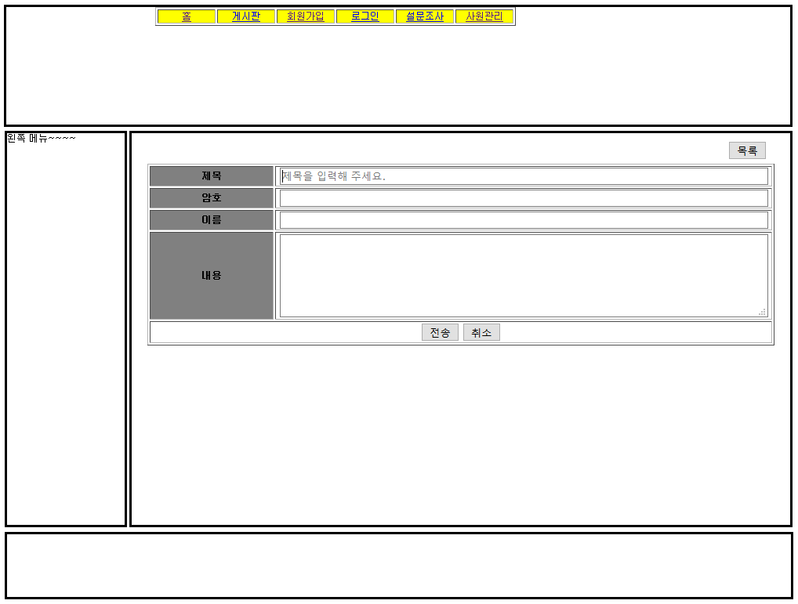
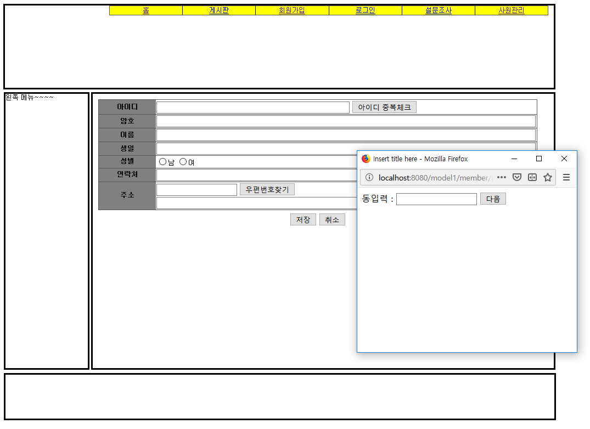

# 로그인 및 게시판 웹 페이지

 
 

## 1. 개요

게시판 기능과 로그인 기능이 주된 웹 페이지 입니다.

 
 

## 2. 주요 기능

- 회원가입, 로그인
- 회원정보 수정, 삭제
- 게시글 작성, 수정, 삭제
- 답변 게시글 작성, 수정, 삭제

 
 

## 3. 사용 언어 및 도구

- JSP
- Javascript
- HTML/CSS
- jquery
- MYSQL
- eclipse/apache-tomcat
- autoset(MYSQL)

 
 

## 4. 실행 이미지

## 5. 활용 방법

- 따로 DB 구조를 업로드 해두지 않았기 때문에 apple 데이터베이스를 생성하여 board, member 등의 테이블과 쿼리들을 작성해주셔야합니다.
- 우편번호 검색 시 활용될 DB는 우체국에서 제공하는 우편번호 DB를 활용하십시오.

 
 

## 6. 보완해야할 점

- 각 기능을 다뤄보는 데에 중점을 뒀기 때문에 CSS 디자인이 엉망진창입니다.
- 좌측의 메뉴가 특정 페이지 이외에 출력되지 않습니다.
- 설문조사 메뉴를 아직 구현하지 않았습니다. 하지만 구현하더라도 게시판과 비슷한 구조일 것입니다.
